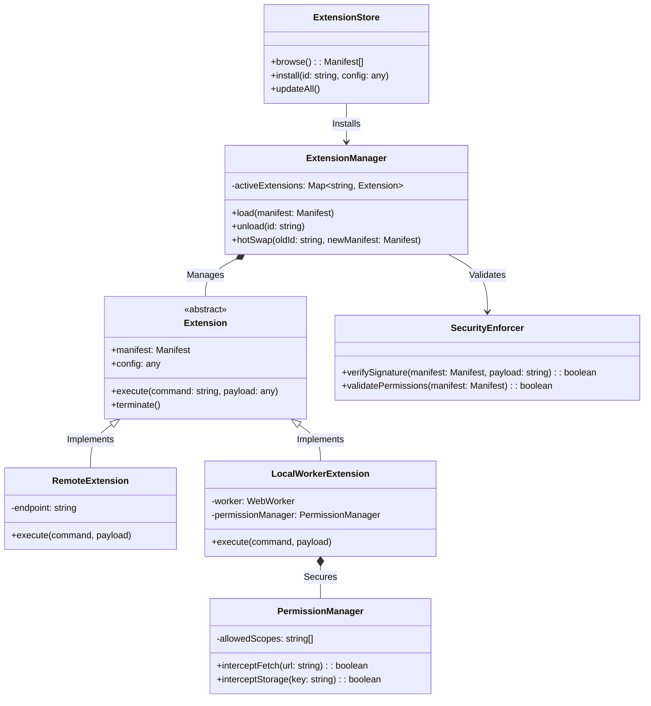
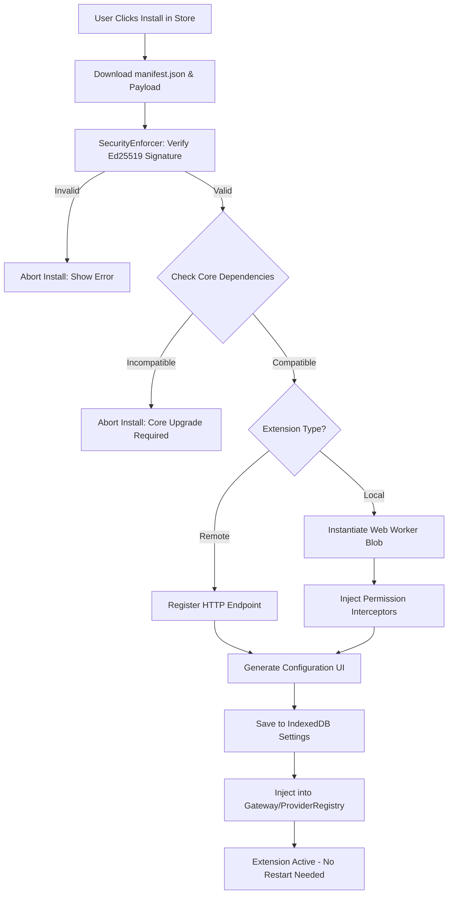

# StreamIndian Extension Store Architecture

This document details the architectural design for the StreamIndian Extension Engine and Store. It provides a highly secure, dynamic, and modular framework allowing the application to be extended at runtime—without recompiling or redeploying the core application. 

This architecture embraces Samsung Tizen's constrained HTML5 environment by enforcing strict sandboxing, remote-first execution, and zero-downtime hot-swapping.

---

## 1. Extension Types

Extensions are strictly categorized by their capability. A single extension can declare multiple capabilities in its manifest.

*   **Providers (Streams):** Resolves stream URLs from IDs (e.g., Torrent indexers, Debrid bridges).
*   **Metadata:** Provides rich media data (e.g., Custom localized TMDB scrapers, MyAnimeList bridges).
*   **IPTV:** Parses and normalizes live TV playlists (e.g., Xtream Codes connectors, custom EPG scrapers).
*   **Subtitles:** Fetches subtitle tracks based on video hashes or IMDB IDs.
*   **Themes:** CSS/JSON variables mapped to the UI styling engine (Colors, Fonts, Spacing).
*   **Recommendation Engines:** Replaces the default discovery rows with custom algorithms (e.g., Trakt personalized recommendations, MDBList smart filters).
*   **Extensions (Core):** Low-level utilities (e.g., Analytics trackers, custom debuggers, UI widgets).

---

## 2. Core Extension Paradigms

To accommodate Tizen's CPU limitations and security policies, extensions operate in one of two paradigms:

### A. Remote Extensions (The Stremio Model)
*   **Architecture:** The extension is a remote HTTP server returning JSON manifests and data.
*   **Execution:** 0% CPU footprint on the TV. The TV simply issues standard HTTP GET requests.
*   **Sandboxing:** 100% Secure. The extension has zero access to the TV's memory or DOM.
*   **Hot Loading:** Instant. The URL is added to the registry, and the app begins querying it.

### B. Local Extensions (The Web Worker Model)
*   **Architecture:** JavaScript bundles (`.js`) downloaded and executed locally.
*   **Execution:** Runs strictly inside a **Web Worker**. 
*   **Sandboxing:** High. Web Workers have no access to the DOM (`window`, `document`). The core app passes data to the Worker via `postMessage`, and the Worker responds. Network requests (`fetch`) are intercepted and routed through the core's permission manager.
*   **Hot Loading:** A new `Worker()` is spun up dynamically. Hot unloading simply calls `worker.terminate()`.

---

## 3. The Extension Manifest

Every extension (Local or Remote) is defined by a `manifest.json`. This acts as the unchangeable contract between the Extension and the StreamIndian Core.

```json
{
  "id": "com.streamindian.provider.torrentio",
  "name": "Torrentio",
  "version": "2.1.0",
  "description": "Premium torrent stream resolver.",
  "type": ["provider", "metadata"],
  "execution": "remote", 
  "entrypoint": "https://torrentio.strem.fun/manifest.json",
  "author": "Community",
  "permissions": [
    "network:fetch",
    "storage:local"
  ],
  "dependencies": {
    "streamindian-core": ">=1.0.0"
  },
  "configuration": [
    {
      "key": "debrid_token",
      "type": "string",
      "label": "Debrid API Key",
      "required": false
    }
  ],
  "signature": {
    "algorithm": "Ed25519",
    "hash": "abc123xyz...",
    "publicKey": "pub_key_string"
  }
}
```

---

## 4. Architectural Pillars

### Permissions & Sandboxing
Local Web Worker extensions operate in a restricted environment.
*   The global `fetch` API is overwritten inside the Worker. When the extension calls `fetch()`, it sends an IPC message to the Main Thread. The `PermissionManager` intercepts this, checks if the extension has the `network:fetch` permission, and executes it on its behalf.
*   No DOM access prevents malicious code from injecting overlays, scraping passwords, or stealing user focus (critical for TV navigation).

### Digital Signatures & Integrity
*   Extensions hosted on the official StreamIndian Store must be cryptographically signed.
*   The `manifest.json` contains a hash of the executable payload and an Ed25519 signature.
*   When downloading an extension, the `ExtensionManager` verifies the payload against the signature using a hardcoded public key in the StreamIndian core. If it fails, the extension is blocked from instantiating.

### Dependencies & Versioning
*   Extensions use strict Semantic Versioning (SemVer).
*   The `manifest.json` declares the minimum `streamindian-core` version required. If the TV app is outdated, the store disables the "Install" button to prevent runtime crashes.

### Hot Loading & Unloading
*   **Loading:** The user clicks "Install". The Core downloads the manifest -> Verifies Signature -> Extracts configuration schema -> Renders a dynamic Settings UI (for API keys) -> Instantiates the Web Worker (or registers the Remote URL) -> Injects it into the `ProviderRegistry` via the `GatewayManager`.
*   **Unloading:** The user clicks "Uninstall". The Core removes it from the `ProviderRegistry` -> Calls `worker.terminate()` (force-killing all running extension threads) -> Garbage collects memory -> Purges IndexedDB configurations. **No app restart required.**

### Updates
*   A background `ExtensionUpdateService` polls the Store Repository every 24 hours.
*   If a version bump is detected, it downloads the new payload.
*   It performs a **Hot Swap**: It spins up the v2.0 Worker, waits for it to initialize, swaps the pointer in the `ProviderRegistry`, and terminates the v1.0 Worker. Playback is entirely unaffected.

---

## 5. Diagnostics & Telemetry

Extensions are black boxes, meaning they are prone to causing silent failures. The `ExtensionDiagnosticsEngine` wraps all extension IPC calls in a monitoring layer:

*   **Timeout Tracking:** If a Local Worker takes > 5000ms to respond to a search query, it is flagged.
*   **Crash Detection:** If a Web Worker throws a fatal exception, the `ExtensionManager` catches it via `worker.onerror`, logs the stack trace to the Diagnostics UI, and auto-disables the extension.
*   **Resource Monitoring:** Tracks average execution time per extension. Heavily degraded extensions trigger the "Circuit Breaker" (as designed in the Provider Engine).

---

## 6. Architecture Diagrams

### UML Architecture



### Hot-Load & Security Flowchart



---

## 7. Conclusion

By strictly adhering to an asynchronous, worker-based (or remote-based) model, StreamIndian achieves the ultimate balance of extensibility and security. The Samsung Tizen core application remains a pristine, thin orchestration layer, while complex community logic runs in heavily guarded sandboxes that can be installed, updated, and terminated at will.
