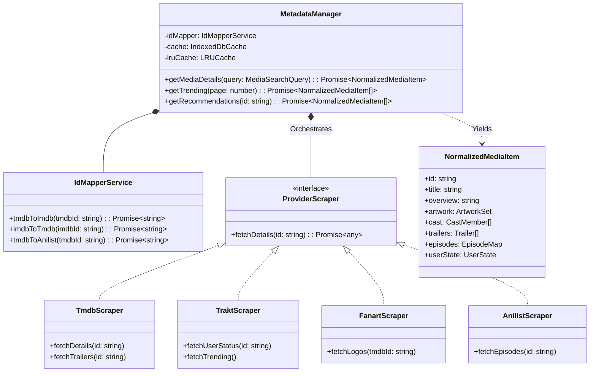

# StreamIndian Ultimate Metadata Engine Design

This document details the architecture of a unified, highly-performant Metadata Engine for StreamIndian, synthesizing the best practices from Jellyfin, PlayTorrio, and Kodi. It is designed to aggregate, normalize, and cache rich media data for a premium TV experience while adhering to Samsung Tizen's memory constraints.

---

## 1. Repository Analysis: Metadata Paradigms

*   **Jellyfin:** Server-heavy architecture. Scrapes metadata via plugins (TMDB, TVDB, Fanart) during library scans, normalizes it into a unified SQLite database, and serves JSON to thin clients. Excellent at deep data aggregation and relationships (Actors, Collections).
*   **PlayTorrio:** Client-side aggregation. Fetches on-the-fly from TMDB and Trakt, heavily caching responses in memory and IndexedDB. Fast but can suffer from network bottlenecks if a single view requests 50+ rich metadata items.
*   **Kodi:** Uses dedicated "Scrapers" (regex/Python based) for local files. Aggregates data into a local relational database, supporting extensive artwork via local or remote URLs (Fanart.tv). Emphasizes skin-driven flexibility for displaying complex metadata.

---

## 2. Provider Ecosystem & Roles

To build a premium OTT experience, the engine must orchestrate multiple specialized providers:

### Primary Data Sources
*   **TMDB (The Movie Database):** The foundational source of truth. Provides primary metadata (titles, overviews, release dates), cast/crew, genres, standard posters/backdrops, and trailers (via YouTube IDs).
*   **Trakt:** The primary engine for user-specific metadata. Provides watch history, synchronized watchlists, custom user lists, and highly accurate global trending/popular metrics.
*   **TVDB:** Used as a fallback for niche TV shows or specific episode metadata (absolute vs. DVD ordering) when TMDB data is sparse.

### Specialized Artwork & Media
*   **Fanart.tv:** The ultimate source for premium, high-res clean artwork. Provides clearlogos (transparent PNG logos), disc art, landscape thumbs, and textless backdrops essential for a Netflix-style UI.
*   **YouTube (via TMDB):** Used exclusively for fetching trailer streams.

### Anime Subsystem
*   **AniList / Kitsu:** TMDB and TVDB often mishandle Anime seasons (e.g., treating a continuous 500-episode show as multiple arbitrary seasons). These providers are used to fetch accurate absolute numbering, anime-specific metadata, and localized titles (Romaji/English).

### Aggregation & Curation
*   **MDBList:** Used for advanced, dynamic smart lists (e.g., "Top 100 Sci-Fi on Netflix") and complex cross-referencing between IMDB, TMDB, and Trakt IDs.

### Subtitles (Metadata Layer)
*   **OpenSubtitles:** Indexed by the metadata engine prior to playback to display available subtitle languages on the Details Page.

---

## 3. The Merged Metadata Architecture

The engine uses an **ID Mapper** and an **Aggregator** pattern to unify disparate API responses into a single `NormalizedMediaItem` object that the UI consumes.

### A. The Universal ID Mapper
Providers use different primary keys (TMDB ID, IMDB ID, TVDB ID, AniList ID). The engine's lowest layer is the `IdMapperService`, which resolves cross-provider identities. If the UI requests an IMDB ID (`tt0111161`), the Mapper immediately resolves the equivalent TMDB and Trakt IDs to allow parallel fetching.

### B. The Aggregator Engine
When the UI requests full details for a movie/show, the `MetadataManager` fires concurrent requests:
1.  **TMDB:** Fetch Base Info, Cast, Crew, Recommendations, Trailers.
2.  **Fanart.tv:** Fetch ClearLogos and Textless Backdrops.
3.  **Trakt:** Fetch User History (is it watched?), Rating, and User Collections.
4.  *(If Anime)* **AniList:** Fetch absolute episode mapping.

The Aggregator waits for `Promise.allSettled()`, merges the data, and produces a rich, unified object.

### C. Entity Management
*   **Artwork (Posters & Backdrops):** Handled gracefully. If Fanart clearlogos fail, fall back to TMDB text posters. All image URLs are passed through a local proxy/resizer URL if available, or resized via query parameters (e.g., TMDB `w500` vs `original`) based on Tizen screen resolution.
*   **Collections:** TMDB Collections are mapped to UI carousels (e.g., "The Matrix Collection").
*   **Recommendations:** Aggregated from TMDB "Similar/Recommendations" and Trakt "Related" to build endless discovery queues.
*   **Trailers:** Extracted and passed to the `TrailerManager` which resolves the YouTube ID into a direct MP4 stream for background autoplay on the Details Page.

### D. Caching Strategy
*   **Memory Cache (LRU):** Fast, short-lived cache (5-10 minutes) for instant UI navigation (e.g., hitting "Back" from a player).
*   **IndexedDB Cache:** Long-lived cache (24-48 hours) for static metadata (movie plot, cast, posters).
*   **Stale-While-Revalidate:** The UI instantly loads IndexedDB data while a background thread fetches updates (e.g., new episodes or updated Trakt watch status) and patches the UI reactively.

---

## 4. UML Architecture Diagram

---

## 5. Samsung Tizen Specific Optimizations

To ensure the Metadata Engine does not crash the Smart TV, the following rules apply:

1.  **Image Optimization:** A 4K TV UI does not need a 4K poster for a small grid item. The engine *must* strictly enforce URL resizing (e.g., appending `/w342` to TMDB URLs). Only the active Details Page backdrop should request `/original`.
2.  **Pagination & Pruning:** If an actor has 150 credits, the engine must prune the array to the top 20 before saving to IndexedDB or passing to the React UI to prevent DOM bloat and JSON parsing lag.
3.  **Background Autoplay Preloading:** When the Details Page loads, the `MetadataManager` yields the `NormalizedMediaItem` immediately without waiting for the Trailer URL to resolve. Trailer resolution happens lazily in the background.
4.  **No Heavy Parsing on Main Thread:** Large JSON responses (e.g., an entire show's TMDB season/episode manifest) should be parsed and mapped in a Web Worker if possible, to avoid dropping UI frames during navigation.
