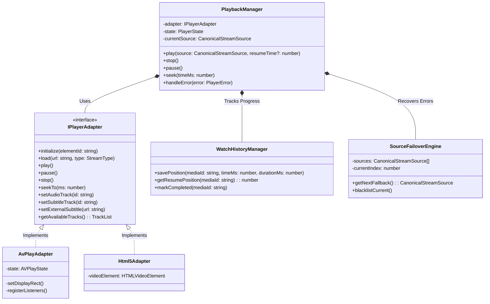
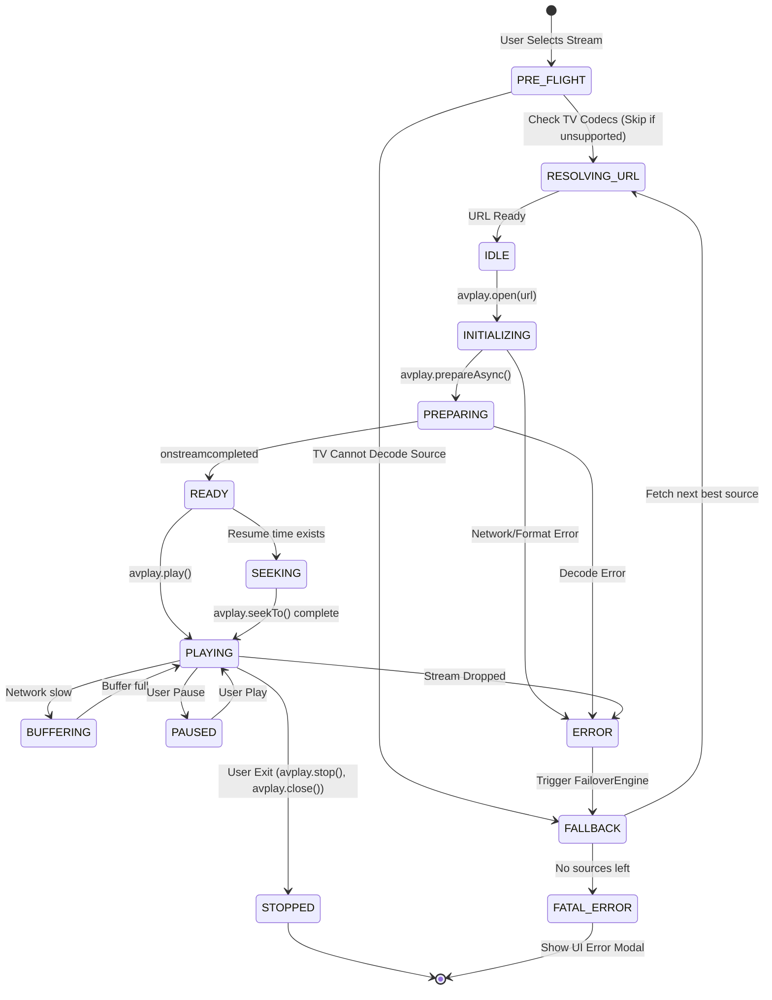

# StreamIndian Ultimate Playback Engine Design

This document synthesizes the playback architectures of Kodi, PlayTorrio, Jellyfin, and Debrify to design a commercial-grade, TV-first Playback Engine exclusively tailored for Samsung Tizen's `webapis.avplay` and HTML5 environments.

---

## 1. Repository Analysis: Playback Paradigms

*   **Kodi:** Uses a low-level, highly customized C++ VideoPlayer. Excels at robust state management, perfect audio/subtitle track switching, and local caching. Handles format idiosyncrasies natively.
*   **PlayTorrio:** Abstracted web architecture (`PlayerManager`) that swaps between HTML5 (browser) and AVPlay (Tizen). Great at decoupled UI events, but struggles with granular AVPlay error recovery.
*   **Jellyfin:** Client-server capability negotiation. The client (TV) reports codec support; if unsupported, the server transcodes. TV clients act as thin rendering layers with strict resume-state syncing to the server.
*   **Debrify:** Resolves Debrid HTTP streams in the background and passes raw URLs to external/native players. Excellent at handling stream expiry and token refresh mid-playback.

---

## 2. Core Constraints of Samsung Tizen (AVPlay)

Building for Tizen requires acknowledging strict hardware and API limitations:
1.  **Rigid State Machine:** AVPlay throws fatal exceptions if commands are issued in the wrong state (e.g., calling `seekTo` before `PREPARED`).
2.  **Memory Leaks:** Failing to call `avplay.close()` or `avplay.suspend()` when exiting the app or destroying the player component will permanently lock the hardware decoder until the TV is rebooted.
3.  **Subtitles:** External subtitles must be explicitly side-loaded via `setExternalSubtitlePath()`. Embedded MKV subtitles require specific track selection APIs.
4.  **Codec Limits:** If you feed AVPlay a Dolby Vision profile it doesn't support, it crashes. We must filter out unsupported sources *before* playback begins.

---

## 3. The Ultimate Playback Architecture

The engine is composed of highly decoupled managers acting as a facade over the native `webapis.avplay` object.

### A. Pre-Flight & Capability Filtering (Jellyfin Style)
Before attempting playback, the `DeviceProfileManager` checks TV capabilities (`webapis.tvinfo`, `webapis.productinfo`). 
*   If the source is 4K but the TV is 1080p -> Downscale or pick a 1080p source.
*   If the source is AV1 but the TV is a 2019 model -> Skip source and fallback to HEVC/H264.

### B. Playback Lifecycle (State Machine)
The player operates on a strict, event-driven state machine to prevent AVPlay API violations:
1.  **RESOLVING:** Translating the `CanonicalStreamSource` (e.g., Torrent) into a playable HTTP URL via Debrid or internal proxy.
2.  **INITIALIZING:** Calling `avplay.open(url)` and setting the DRM parameters if applicable.
3.  **PREPARING:** Calling `avplay.prepareAsync()`. The UI shows a loading spinner.
4.  **BUFFERING:** AVPlay fires `onbufferingstart`. UI shows buffer percentage.
5.  **PLAYING:** AVPlay fires `oncurrentplaytime`. UI hides overlay.

### C. Track Selection (Audio & Subtitles)
*   **Audio Selection:** The engine parses embedded audio tracks during the `PREPARED` state using `avplay.getTotalTrackInfo()`. It selects the optimal track based on user language preferences and receiver capabilities (e.g., passing through Dolby Digital+ / Atmos if an eARC soundbar is detected).
*   **Subtitle Loading:** 
    *   *Embedded:* Selected via `avplay.setSelectTrack('SUBTITLE', index)`.
    *   *External (OpenSubtitles):* Downloaded to a local blob/memory cache, converted to SRT/SMI (if necessary), and injected via `avplay.setExternalSubtitlePath()`.

### D. Resume & Continue Watching
*   **Throttled Syncing:** The `WatchHistoryManager` listens to time updates and persists the `currentTime` to IndexedDB every 10 seconds.
*   **Resume Execution:** If a resume point exists, the engine waits for the `PREPARED` state, calls `avplay.seekTo(resumeTime)`, and *then* initiates `play()`.

### E. Error Recovery & Source Fallback (Debrify Style)
*   If AVPlay throws a decode error (`PLAYER_ERROR_NOT_SUPPORTED_FILE`) or network timeout, the `PlaybackManager` intercepts it.
*   Instead of failing to the home screen, it marks the current `CanonicalStreamSource` as dead, auto-selects the next best source from the Gateway, and restarts the lifecycle seamlessly.

---

## 4. Architectural Diagrams

### UML Class Diagram

### AVPlay State Machine & Fallback Flowchart

---

## 5. Caching & Performance Considerations on Tizen

1.  **DASH/HLS Buffer Size:** For HLS/DASH streams, use `avplay.setStreamingProperty('ADAPTIVE_INFO', ...)` to increase the buffer size explicitly. Tizen's default buffer is often too small for high-bitrate 4K content, leading to stuttering.
2.  **Display Rect Reflow:** Never use CSS transforms (like `scale()` or `translate()`) on the AVPlay container object. Set the display rect mathematically via `avplay.setDisplayRect(x, y, w, h)`.
3.  **Multitasking/Backgrounding:** Hook into Tizen's `visibilitychange` API. When the app is backgrounded (user presses Home), you MUST call `avplay.suspend()`. When foregrounded, call `avplay.restore()`. Failure to do this will crash the TV's media pipeline.
4.  **Audio Pass-through:** Use `webapis.audiocontrol.setOutputMode('AUTO')` to ensure AC3/EAC3/Atmos is bitstreamed to the user's soundbar, bypassing Tizen's internal stereo downmixer.
