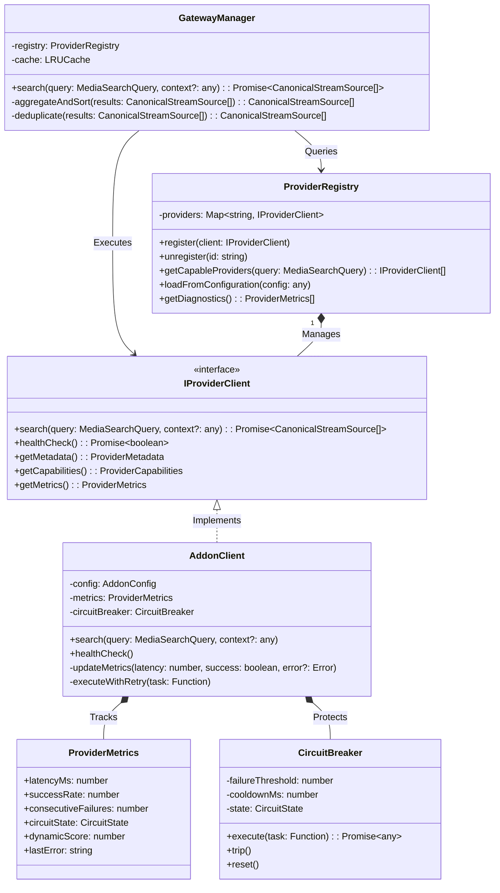
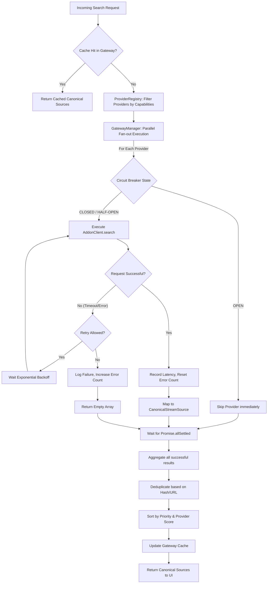
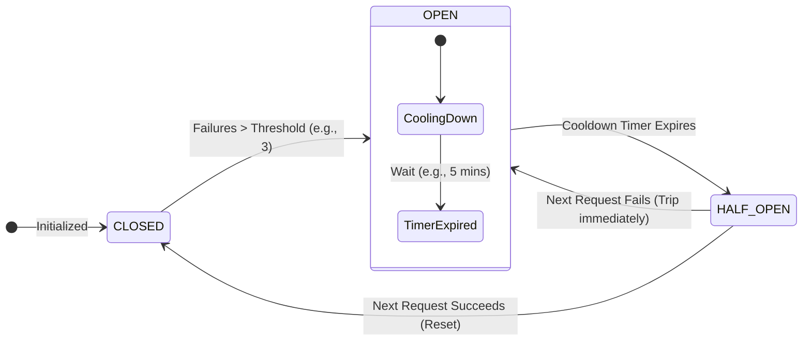

# StreamIndian Ultimate Provider Engine Design

This document details the architectural enhancements for the StreamIndian Provider Engine. It builds upon the existing `IProviderClient`, `ProviderRegistry`, `GatewayManager`, and `AddonClient` components, elevating them to a highly resilient, scalable, and self-healing subsystem designed for a commercial-grade Samsung Tizen application.

---

## 1. Core Enhancements & Capabilities

### Resiliency & Health
*   **Circuit Breaker Pattern:** Prevents cascading failures. If a provider fails continuously, its circuit "opens," immediately short-circuiting future requests to allow the provider time to recover (e.g., bypassing Cloudflare blocks).
*   **Health Monitoring & Automatic Disabling:** Passive health tracking based on search success/failure rates. Providers falling below a health threshold are temporarily disabled.
*   **Automatic Retries:** Granular retry logic inside the provider execution wrapper, featuring exponential backoff for recoverable errors (e.g., HTTP 429, 500, 502) before logging a failure.

### Performance & Telemetry
*   **Provider Scoring & Latency Measurement:** Every search request measures Time-to-First-Byte (TTFB) and total resolution time. Providers are scored dynamically: `Score = (Success Rate * Priority Weight) - Latency Penalty`.
*   **Failure Statistics & Diagnostics:** Granular metrics (timeouts, HTTP errors, parse errors, empty results) are logged per provider. These power a Developer Diagnostics UI.
*   **Caching:** Aggressive, multi-tiered LRU caching at the `GatewayManager` level, utilizing composite keys based on media IDs and contextual parameters (e.g., Debrid keys).
*   **Parallel Execution:** `GatewayManager` acts as a fan-out orchestrator, firing concurrent non-blocking requests to all capable providers using `Promise.allSettled`.

### Architecture & Extensibility
*   **Capability Discovery:** Providers declare their capabilities (Movies, Episodes, Anime, Live TV, 4K resolution support). The Gateway filters providers before execution based on the search query.
*   **Provider Priorities:** Static priorities configured at initialization, dynamically adjusted at runtime by the Provider Score.
*   **Configuration-Driven Providers & Extension Loading:** Providers are instantiated from a central JSON/YAML configuration file. Custom extensions can be dynamically injected into the `ProviderRegistry` at runtime.

---

## 2. UML Class Diagram

This diagram illustrates how the existing architecture is augmented with metrics, state tracking, and orchestration layers.

---

## 3. Search Execution Pipeline (Flowchart)

This flowchart dictates the exact sequence of events when `GatewayManager.search()` is invoked. It highlights caching, capability filtering, parallel fan-out execution, and aggregation.

---

## 4. Circuit Breaker & Health State Machine

The Circuit Breaker pattern is critical for maintaining app performance. A misbehaving provider (e.g., Torrentio timing out) must not drag down the entire search pipeline.

### Metrics & Scoring Formula
The dynamic provider score is calculated on every successful request to favor the fastest and most reliable providers during the final result aggregation sorting:

`Score = (Base Priority * 100) + (Success Rate * 50) - (Avg Latency in Seconds * 10)`

---

## 5. Next Steps for Implementation

1.  **Introduce `CircuitBreaker` utility:** A lightweight class to wrap external `fetch` calls.
2.  **Add `ProviderMetrics` to `AddonClient`:** Track latencies, error counts, and circuit states internally.
3.  **Enhance `ProviderRegistry`:** Add capability filtering logic (e.g., `getCapableProviders`).
4.  **Gateway Result Sorting:** Update the aggregation logic in `GatewayManager` to sort `CanonicalStreamSource` arrays based on the generating provider's dynamic score.
5.  **Build Diagnostics Payload:** Expose a method returning all metrics to be consumed by a future "Developer Settings" diagnostic screen.
