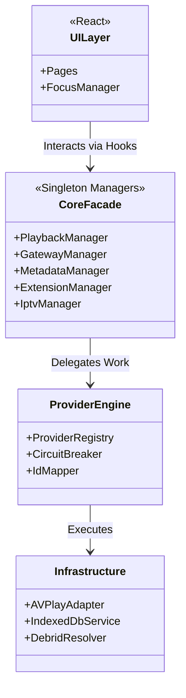
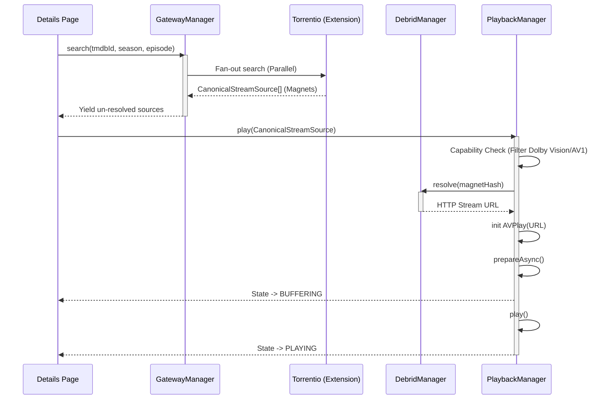
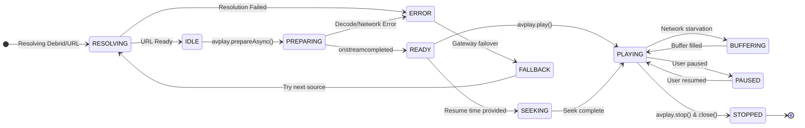

# StreamIndian Definitive Architecture & Engineering Reference

This document serves as the permanent, authoritative engineering reference for the StreamIndian project. It defines the definitive architecture tailored **exclusively** for Samsung Tizen Smart TVs, ensuring a premium, commercial-grade, and highly performant OTT streaming experience.

---

## 1. Core Philosophy & Platform Constraints
*   **Target:** Samsung Tizen TV ONLY.
*   **Performance First:** Aggressive memory management, zero DOM bloat, flat focus maps.
*   **Decoupling:** UI relies completely on Core Managers. Core Managers orchestrate decoupled Providers.
*   **Hardware Reality:** Tizen has weak CPUs and limited RAM. Parsing, heavy filtering, and background orchestration must utilize Web Workers.
*   **No Media Downloads:** "Downloads" are strictly limited to local caching of metadata, artwork, and subtitles. Tizen TVs lack the local disk space for media file downloads.

---

## 2. Definitive Folder Structure

```text
/src
 ├── /core                  # Pure business logic (No UI, No React)
 │    ├── /playback         # AVPlay wrapper, track selection, capability profiling
 │    ├── /gateway          # Provider orchestration, fan-out search, circuit breakers
 │    ├── /metadata         # TMDB, Fanart, Trakt aggregation
 │    ├── /iptv             # M3U/Xtream parsing (via Web Workers), EPG management
 │    ├── /debrid           # Debrid resolution, token lifecycle
 │    ├── /storage          # IndexedDB schema, LRU caches
 │    ├── /extensions       # Manifest parsing, Worker instantiation, security
 │    ├── /auth             # Trakt/Debrid OAuth device flows
 │    └── /diagnostics      # Telemetry, performance tracking, logging
 ├── /ui                    # React Presentation Layer
 │    ├── /components       # Reusable atoms (Buttons, Virtual Lists, Lazy Images)
 │    ├── /pages            # Route views (Home, Details, Player, Settings)
 │    ├── /navigation       # Flat map spatial focus engine (D-Pad logic)
 │    └── /hooks            # React bindings to Core Managers
 ├── /providers             # Core integrations (Bundled extensions)
 ├── /workers               # Dedicated Web Workers (M3U parsing, JSON crunching)
 ├── /styles                # Global Tailwind/CSS limits (No backdrop-filters)
 └── /types                 # Global TypeScript definitions
```

---

## 3. Dependency Graph & Architecture Layers

StreamIndian enforces a **Strict Unidirectional Downward Dependency Graph**:

```text
[ Presentation Layer (React UI, Spatial Navigation) ]
                          │ (Hooks / Observers)
                          ▼
[ Core Orchestrators (Playback, Gateway, Metadata, IPTV) ]
                          │ (Interfaces / Contracts)
                          ▼
[ Extension / Provider Engine (Remote Addons, Local Workers) ]
                          │ (Fetch / WebSockets)
                          ▼
[ Infrastructure (Tizen webapis, IndexedDB, External APIs) ]
```
*Rule: Providers must never import from UI. Core must never import from UI.*

---

## 4. System UML & Component Diagrams

### High-Level Component Diagram


---

## 5. Sequence Diagram: Search to Playback

This sequence demonstrates the complex flow of finding and playing a stream without blocking the UI.



---

## 6. State Machines

### AVPlay Playback State Machine
Adhering to Samsung's rigid API requirements to prevent memory leaks and hardware decoder crashes.



---

## 7. API Contracts

### A. Provider API (`IProviderClient`)
```typescript
interface IProviderClient {
    search(query: MediaSearchQuery, context?: ProviderContext): Promise<CanonicalStreamSource[]>;
    getMetadata(): ProviderMetadata;
    getCapabilities(): ProviderCapabilities;
    healthCheck(): Promise<boolean>;
    getMetrics(): ProviderMetrics;
}
```

### B. Extension API (`manifest.json`)
```json
{
  "id": "com.streamindian.ext.tmdb_premium",
  "name": "TMDB Premium Meta",
  "version": "1.0.0",
  "type": ["metadata"],
  "execution": "remote",
  "entrypoint": "https://api.extension.com/manifest.json",
  "permissions": ["network:fetch"]
}
```

---

## 8. Storage Model (IndexedDB)

Due to RAM constraints, global state relies on IndexedDB (`dexie.js`), queried via paginated cursors.

1.  **MetadataTable:** `[tmdbId (PK)]`, title, overview, poster, cast (JSON), ttl.
2.  **HistoryTable:** `[mediaId (PK)]`, currentTime, duration, lastWatchedAt (Index), completed.
3.  **IptvChannelsTable:** `[channelId (PK)]`, name, logo, group (Index), url.
4.  **IptvEpgTable:** `[channelId+startTime (PK)]`, title, description, endTime.
5.  **SettingsTable:** `[key (PK)]`, value.

---

## 9. Migration Roadmap from PlayTorrioV2

StreamIndian is currently a derivative of PlayTorrioV2. To reach the target architecture, we must execute the following migration:

*   **Phase 1: Decoupling UI & Logic**
    *   Remove all raw API `fetch` calls from React components.
    *   Abstract all state into the Core Managers (GatewayManager, MetadataManager).
*   **Phase 2: Tizen-First Playback**
    *   Deprecate the HTML5 Video fallback in the production build.
    *   Enhance `PlayTorrioV2`'s basic AVPlay wrapper into the strict State Machine defined above.
    *   Implement Device Capability Filtering before playback.
*   **Phase 3: The Gateway Evolution**
    *   Convert hardcoded providers into the dynamic Extension Engine.
    *   Implement Circuit Breakers, fan-out execution, and dynamic scoring.
*   **Phase 4: Live TV Overhaul**
    *   Delete the main-thread M3U parser.
    *   Implement Web Worker parsing and IndexedDB storage for IPTV.

---

## 10. Final Engineering Roadmap

| Quarter | Focus Area | Deliverables |
| :--- | :--- | :--- |
| **Q1** | **Core Stability & AVPlay** | Strict AVPlay state machine, Background Debrid resolution, Capability filtering, UI Virtualization, Tizen memory optimization. |
| **Q2** | **Extension Engine & Gateway** | Circuit Breaker pattern, Fan-out Search, Stremio Manifest Protocol support, Remote Extension Store. |
| **Q3** | **Metadata & Sync** | TMDB/Fanart unified aggregator, Trakt two-way sync, Stale-while-revalidate IndexedDB caching. |
| **Q4** | **IPTV & Polish** | Web Worker M3U parsing, Xtream API native support, EPG indexing, Diagnostics Dashboard, App Store Submission. |

---

## 11. Coding Standards

1.  **Strict TypeScript:** No `any`. Enable `strict: true`. Use Interfaces for all data models.
2.  **Zero DOM Bloat:** Never render more than 20 items at once. Virtualize all lists.
3.  **Memory Hygiene:** explicitly `null` large objects (like IPTV channel arrays) when navigating away from views to assist the Tizen Garbage Collector.
4.  **No Heavy CSS:** Ban `backdrop-filter`, `box-shadow` on scrolling items, and animating layout properties (`width`, `margin`). Use `transform: translate3d` exclusively.
5.  **Error Handling:** Never let an unhandled promise rejection crash the TV. Wrap all external API calls in Circuit Breakers.

---

## 12. Testing Strategy

1.  **Unit Testing (Vitest):** Core Managers (Gateway, Metadata, Playback State Machine) must have 100% test coverage. They are pure TypeScript and can be tested in Node.js.
2.  **Mocks:** Mock `webapis.avplay` completely for unit tests to ensure state transitions behave correctly when AVPlay throws simulated errors.
3.  **E2E Testing (Playwright):** Run automated spatial navigation tests (D-Pad Up/Down/Left/Right/Enter) to ensure the flat focus map never loses focus.
4.  **Hardware Testing:** No deployment is approved without manual verification on a physical 2019+ Samsung Tizen TV, monitoring RAM usage via the Tizen Studio Device Manager.
